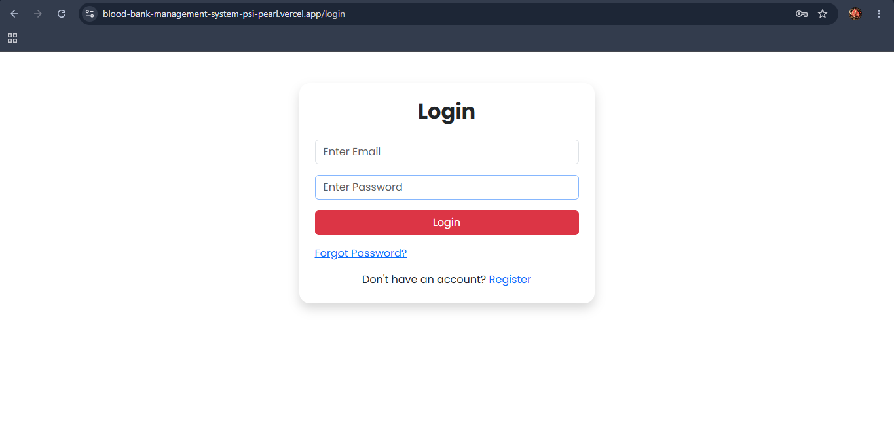
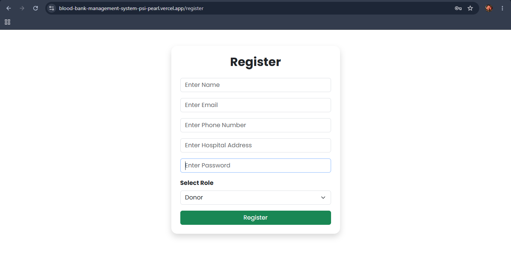
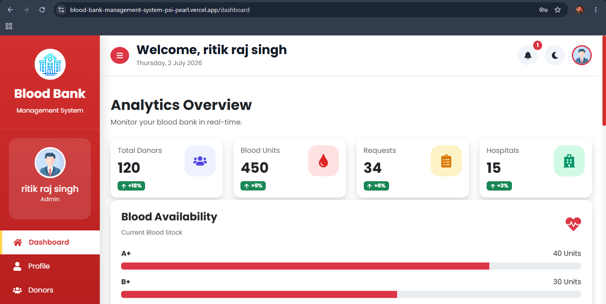
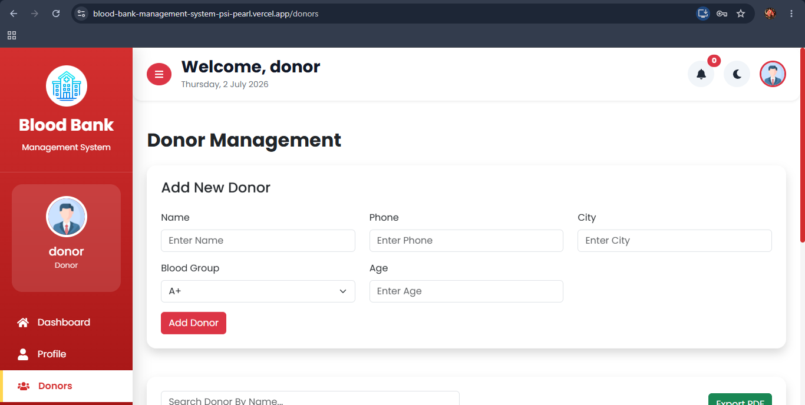
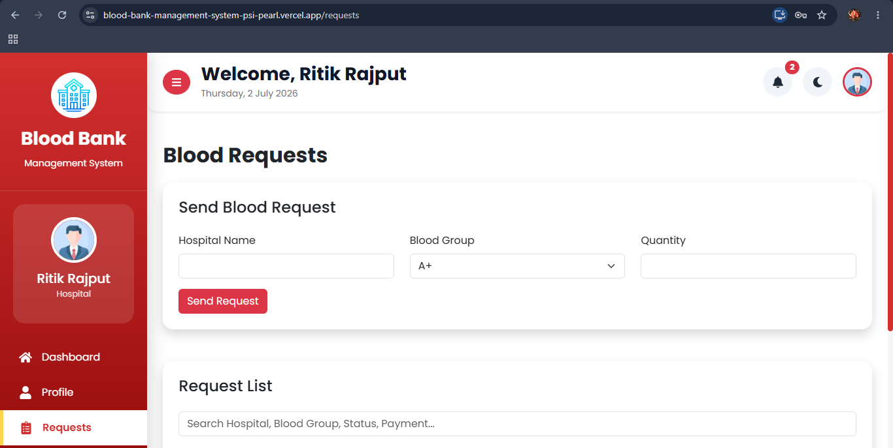

# 🩸 Blood Bank Management System

A full-stack MERN (MongoDB, Express.js, React.js, Node.js) application designed to manage blood donations, hospitals, blood inventory, requests, and payment processing efficiently.

---

# 📌 Features

- User Authentication & Authorization
- Donor Registration & Management
- Hospital Registration & Management
- Blood Inventory Management
- Blood Request System
- Request Approval & Rejection
- Online Payment Processing
- Dashboard Analytics
- Responsive User Interface
- Dark Mode Support

---

# 🛠️ Tech Stack

## Frontend

- React.js
- Bootstrap
- Axios
- React Router DOM

## Backend

- Node.js
- Express.js

## Database

- MongoDB
- Mongoose

## Authentication

- JWT (JSON Web Token)

---

# 📸 Project Screenshots

## Login Page



---

## Register Page



---

## Admin Dashboard



---

## Donor Login



---


## Hospital Login



---

# 🚀 Installation

## Clone Repository

```bash
git clone https://github.com/Ritiksingh9724/blood-management-system.git
```

## Frontend Setup

```bash
cd client
npm install
npm start
```

## Backend Setup

```bash
cd server
npm install
npm run server
```

---

# 🔑 Environment Variables

Create a `.env` file inside the server folder and add:

```env
PORT=5000
MONGO_URL=YOUR_MONGODB_CONNECTION_STRING
JWT_SECRET=YOUR_SECRET_KEY
```

---

# 📡 API Features

- Authentication APIs
- Donor APIs
- Hospital APIs
- Inventory APIs
- Blood Request APIs
- Payment APIs

---

# 📈 Future Improvements

- Email Notifications
- Blood Donation Tracking
- Report Generation
- Admin Analytics Dashboard
- Mobile App Integration

---

# 👨‍💻 Author

**Ritik Singh**

GitHub: https://github.com/Ritiksingh9724

---

⭐ If you like this project, give it a star on GitHub.